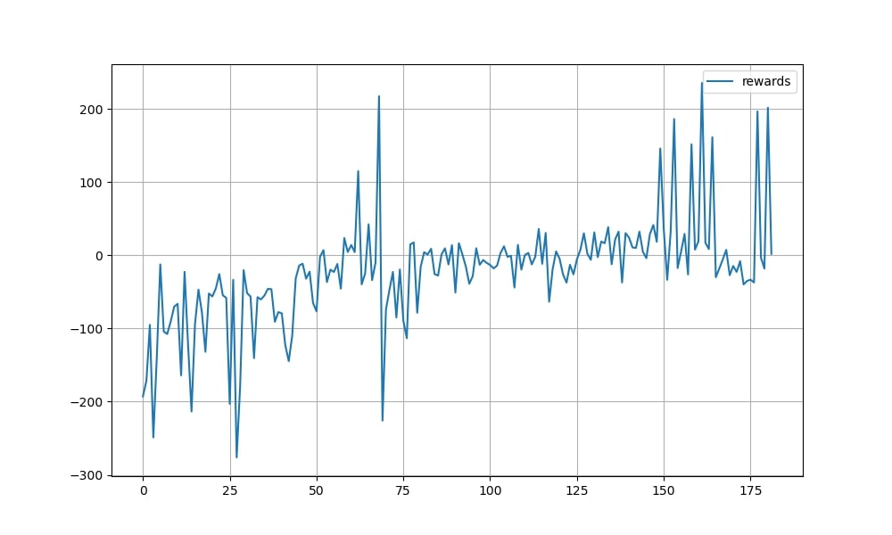
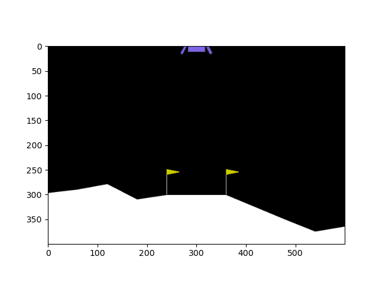
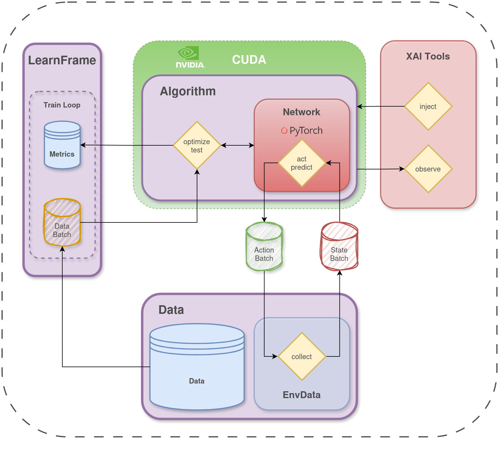

# deeppy

Built on PyTorch, Deeppy is a deep learning framework designed to make model training both simple and flexible.

It embraces a modular approach by decoupling data, algorithms, and neural networks, allowing easy swapping of components and experimentation.

With the planned integration of XAI tools, Deeppy will offer clearer insights into training processes and model behavior.
##
### 1 - Create Your Dataset

```python
import deeppy as dp

env = gym.make("LunarLander-v1")
data = dp.EnvData(env, buffer_size=100000)
```  
### 2 - Create Your Neural-Network
```python
policy_network = {
    "layers" : [obs,128,128,act],
    "blocks" : [nn.Linear, nn.ReLU]
    "out_act" : nn.Softmax,
    "weight_init" : "uniform"
}
``` 
### 3- Choose an Algorithm
```python
model = dp.SAC(**sac_params) #Soft Actor Critic
``` 
### 4-And Finally:
```python
lf = dp.LearningFrame(model, data)

for epoch in range(EPOCH):
	#Take one step in environment using the model
	lf.collect()
	#Train SAC one step
	lf.optimize()
#Automatic plotting 
lf.plot()
``` 


### 5- Watch Your Agent Play
```python
lf.get_anim()
``` 

### 6- Easily Save-Load Your Models
```python
lf.save(file_name)
lf.load(file_name)
``` 
For tutorials and examples please see [tutorials](tutorials)
###
# Setup
```bash
pip install -r requirements.txt
```
# Documentation

Working on it :)



# Currently Implemented Algorithms
### Reinforcement Learning
<details>
 
For tutorials and examples please see [tutorials](tutorials/RL_algorithm_tutorials.ipynb)

[DQN](models/rl/dqn.py)
<details>
<summary> Papers</summary>
       
        DQN        - [https://arxiv.org/abs/2201.07211]
        Double DQN - [https://arxiv.org/abs/1509.06461]
</details>

[Double DQN](models/rl/dqn.py)
<details>
<summary> Papers</summary>

                   - https://arxiv.org/pdf/1910.07207
</details>


[SAC](models/rl/sac.py)
<details>
<summary>Papers</summary>

        Discrete   - https://arxiv.org/abs/1910.07207
        Continuous - https://arxiv.org/abs/1812.05905
</details> 
</details>

### Auto-Encoder

<details>

[B-Vae](models/autoencoder/b_vae.py)
<details>
<summary>Papers</summary>
	               - https://openreview.net/forum?id=Sy2fzU9gl
</details> 
</details>

### Basic-Model

<details>
<summary>See Details</summary>

For tutorials and examples please see [tutorials](tutorials/introduction.ipynb)

</details>

### GPT
<details>
<summary>See Details</summary>

For tutorials and examples please see [tutorials](tutorials/GPT-tutorial.ipynb)

</details>


# To do
### RL


<details>
<summary>See Details</summary>

[Dueling DQN]

[PPO]

[Model Based Policy Optimization (MBPO)]

[SafeMBPO]
</details>


### XAI Tools (Explainable AI)

### CV - NERF

### Neuroevolution


