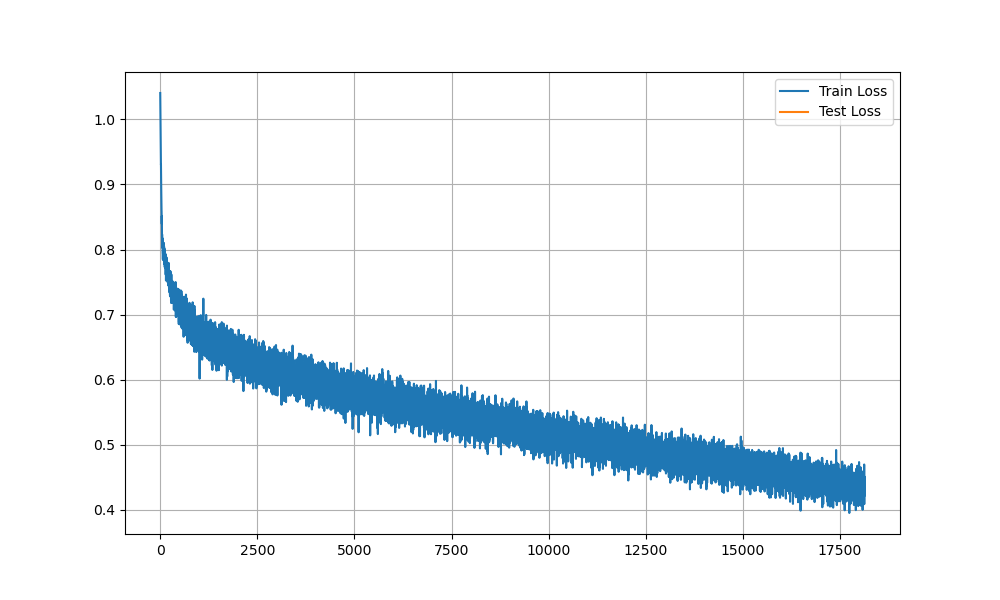
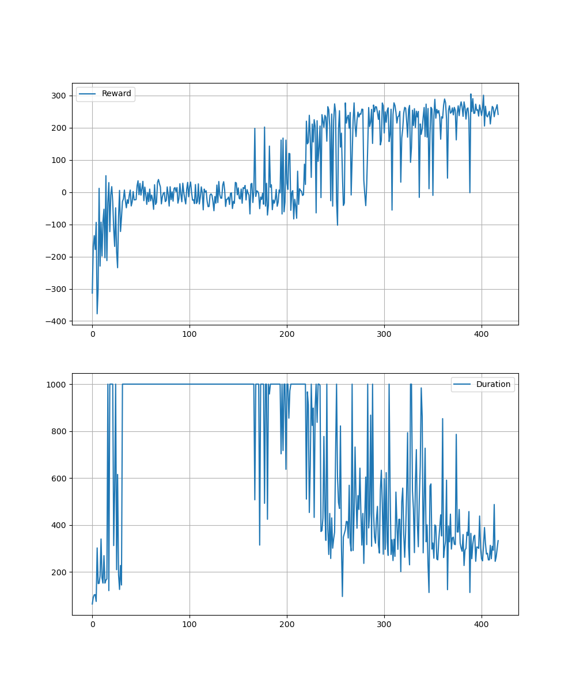

# 🔩 Deeppy

**Deeppy** is a flexible deep learning framework built on **PyTorch**, designed to simplify training workflows while supporting powerful research capabilities. It embraces a **modular approach** by **decoupling data, algorithms, and neural networks**, making it easy to swap components, experiment with new ideas, and customize pipelines end-to-end.


### ✨ Key Features

- 🔧 **Modular by Design** – Swap networks, algorithms, and data pipelines easily  
- 💡 **Research-Oriented** – Designed for flexibility and prototyping  
- 📉 **Integrated Plotting & Logging** – Visualize your training instantly  
- 🔍 **XAI Tooling (Coming Soon)** – Make black-box models more interpretable  
- ⚡ **Built with PyTorch** – GPU, torch compile and AMP support and compatibility by default  

### 🧰 Current Models and Networks

-    <details> <summary><strong>🕹️ Reinforcement Learning</strong></summary>

        - [⚙️  DQN](models/rl/dqn.py) 
            📝 [Tutorial](tutorials/RL_algorithm_tutorials.ipynb)

        - [⚙️  Double DQN](models/rl/dqn.py) - 📝 [Tutorial](tutorials/RL_algorithm_tutorials.ipynb)


        - [⚙️  SAC](models/rl/sac.py) - 📝 [Tutorial](tutorials/RL_algorithm_tutorials.ipynb)
        
</details>

- <details> <summary><strong>📢 Natural Language Processing<strong></summary>

    - [⚙️  GPT](models/nlp/gpt.py) 
        📝 [Tutorial](tutorials/GPT-tutorial.ipynb)

</details>

- <details> <summary><strong>🖼️ Computer Vision<strong></summary>

    - [⚙️  SANE](models/cv/sane.py) 📝 [Tutorial](tutorials/SANE_tutorial.ipynb.ipynb)

    - [⚙️  NeRF](models/cv/nerf.py) 
</details>

- <details> <summary><strong>🔍 Autoencoders<strong></summary>

    - [⚙️  B-VAE](models/autoencoder/b_vae.py) 
    
</details>

- <details> <summary><strong>🔬 Basic Model<strong></summary>

    - [⚙️  Model](models/base_model.py) 
        
        📝 [Introduction Tutorial](tutorials/introduction.ipynb) 
    
        📝 [Advanced Tutorial](tutorials/networks_advanced.ipynb)

</details>
</div>


# ⚡ Quickstart Demos

> 💡 Minimal examples to see Deeppy in action in under 1 minute.

<details open>
<summary>🧠 <strong>Train Your Own GPT Model</strong></summary>


### 📝 Step 1: Load Your Dataset

```python
with open("assets/shakespeare.txt", "r", encoding = "utf-8") as f:
    text = f.read()

encoding = tiktoken.encoding_for_model("gpt-2")
data = GPTText(text=text, tokenizer=encoding, context_size = context_size)
```

### 🧱 Step 2: Build the GPT-Model

```python
GPT_params = {
    "optimizer_params":Optimizer_params,
    "vocab_size":vocab_size,
    "embed_dim":embed_dim,
    "num_heads":num_heads,
    "num_layers":num_layers,
    "context_size":context_size,
    "device":device,
    "criterion":nn.CrossEntropyLoss(ignore_index = -1),
}

model = GPT(**GPT_params)
```
📊 Total Parameters: ~28.9M

### 🔁 Step 3: Train the Model
```python
lf = LearnFrame(model,data)

for i in range(epoch):
    lf.optimize()
lf.plot(show_result=True, log=True)
```


### ✍️ Step 4: Generate Text
```python
model.generate("KING RICHARD III: \n On this very beautiful day, let us")
```
KING RICHARD III: 

 On this very beautiful day, let us us hear
 
The way of the king.


DUKE OF YORK::

I will not be avoided'd with my heart.

DUKEKE VINCENTIO:

I thank you, good father.

LLUCIO:

I thank you, good my lord; I'll to your your daughter.

KING EDWARD IV:

Now, by the jealous queen

</details>

<details> <summary>🎮 <strong>Train a RL Agent</strong></summary>

	
### 🌍 Step 1: Set Up Environment

```python
import deeppy as dp

env = gym.make("LunarLander-v1")
data = dp.EnvData(env, buffer_size=100000)
```  
### 🧠 Step 2: Create Your Network
```python
policy_network = {
    "layers" : [obs,128,128,act],
    "blocks" : [nn.Linear, nn.ReLU]
    "out_act" : nn.Softmax,
    "weight_init" : "uniform"
}
``` 
### ⚙️ Step 3: Choose a RL Algorithm
```python
model = dp.SAC(**sac_params) #Soft Actor Critic
``` 
### 🧪 Step 4: Train the Agent
```python
lf = dp.LearningFrame(model, data)

for epoch in range(EPOCH):
	#Take one step in environment using the model
	lf.collect()
	#Train SAC one step
	lf.optimize()
#Automatic plotting 
lf.plot()
``` 


### 🎥 Step 5: Watch Your Agent
```python
lf.get_anim()
``` 

### 💾 Step 6: Save / Load Your Model
```python
lf.save(file_name)
lf.load(file_name)
```

</details>


## 📚 Explore More Tutorials

Looking to dive deeper? We've included hands-on examples covering everything from GPT training to reinforcement learning agents like LunarLander.

📂 **Find them all in the [`tutorials/`](tutorials) folder**.


# 🛠️ Setup
```bash
pip install -r requirements.txt
```
# 📖 Documentation

Documentation is in progress. Meanwhile, refer to the tutorials folder.


# 🧪 To-Do / Planned Features

### RL

<details> <summary><strong>RL</strong></summary>

Dueling DQN

PPO

MBPO (Model-Based Policy Optimization)

SafeMBPO

</details>

### XAI Tools (Explainable AI)

### Neuroevolution


